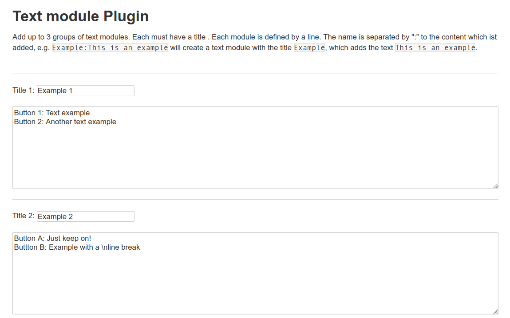
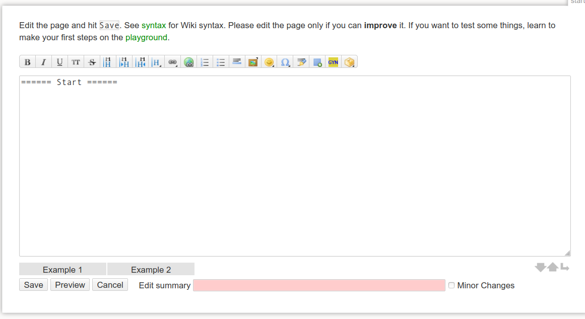
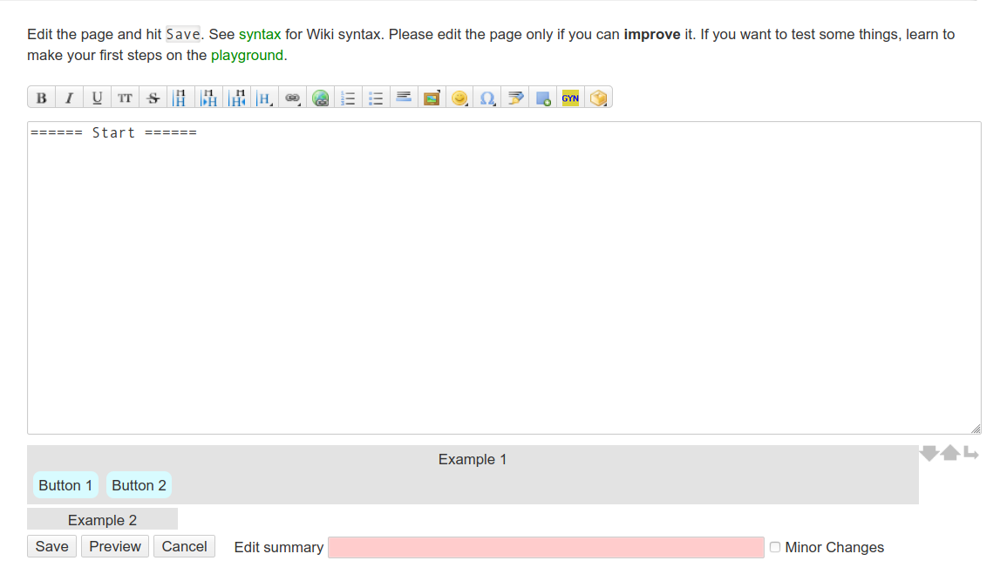
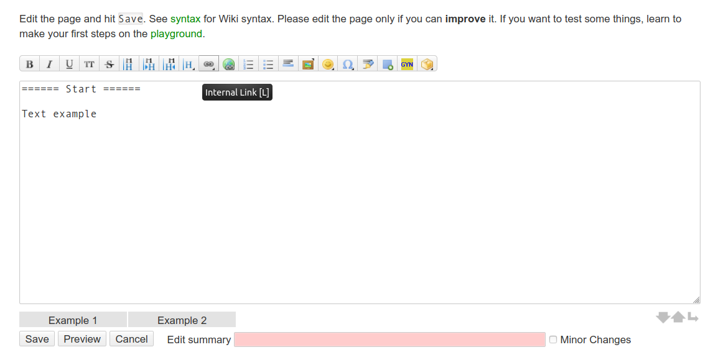

# DokuWiki-Plugin: Text module

This plugin adds buttons beneath the text-editor in dokuwiki. These buttons can be defined in the admin section and can be used to insert text modules, which are also defined in the admin section.

Line breaks can be added using ``\n``.

## Compatibility

* Tested with DokuWiki/**Hogfather**
* Tested with PHP **7.4.13**

## Data

The data of the text modules is stored in the ``data/textmodules.txt`` file.
